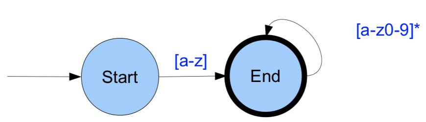
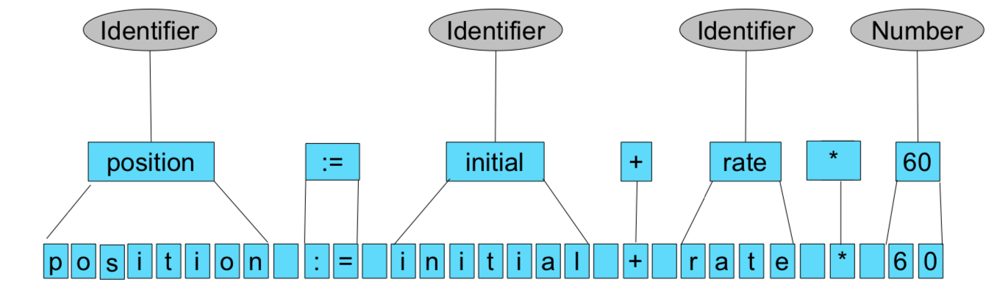
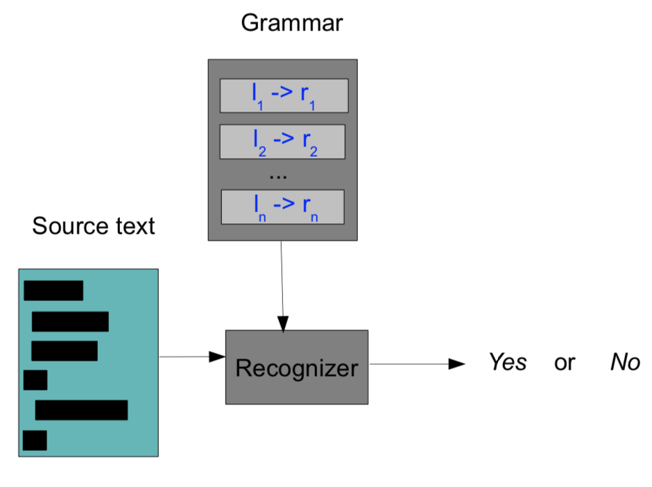
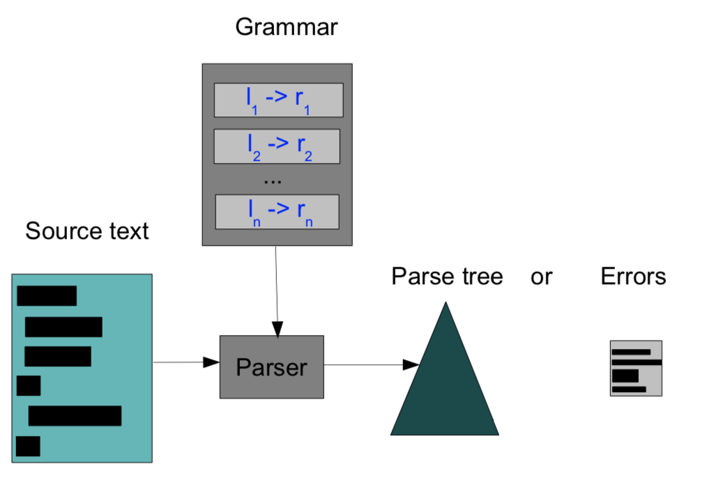
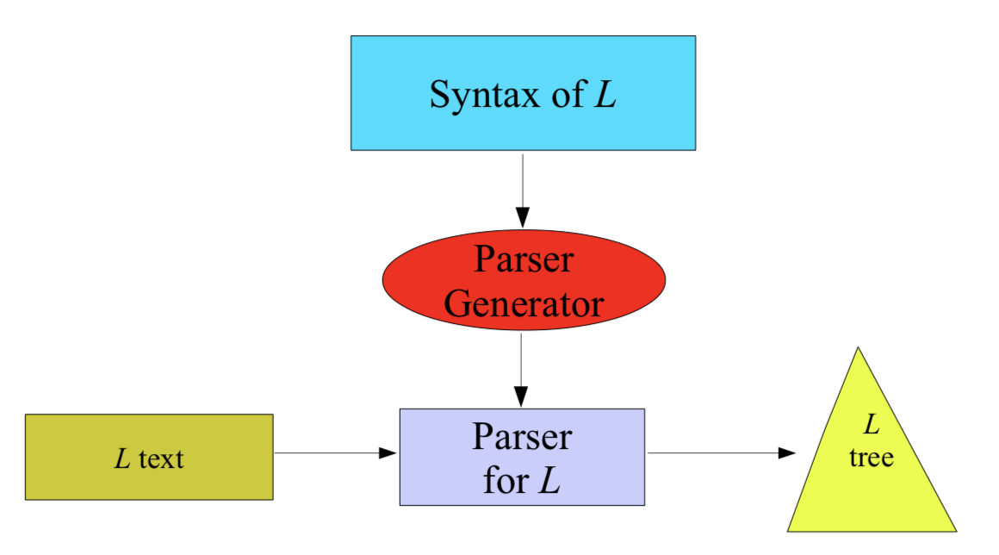
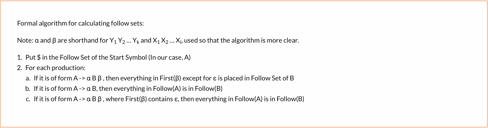
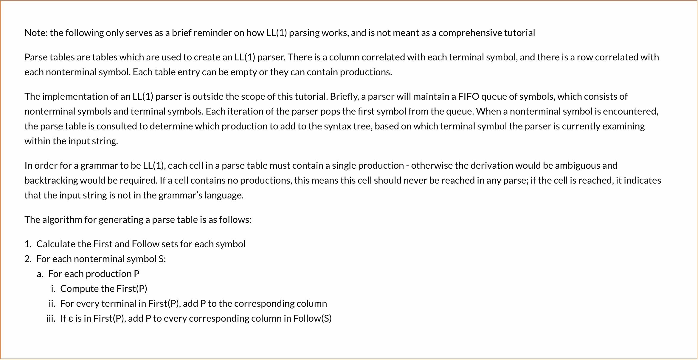

# HW1. Recursive Descent Parser

## Why are Grammars and Parsing Techniques Relevant?

- A ***grammar*** is a formal method to descirbe a (textual) grammar
- ***Parsing:***
  - Tests whether a text conforms to a grammar
  - Turns a correct text into a parse tree


## Chomsky’s Grammar Hierarchy

- Type-0: Recursively Enumerable
  - Rules: α -> β (unrestricted)
- Type-1: Context-sensitive
  - Rules: αAβ -> αγβ
- Type-2: Context-free
  - Rules: A -> γ

- Type-3: Regular
  - Rules: A -> a and A -> aB


## In Practice

- Regular grammars used for lexical syntax:
  - Keywords: if, then, while 
  - Constants: 123, 3.14, “a string” 
  - Comments: /* a comment */

- Context-free grammars used for structured and nested concepts:
  - Class declaration 
  - If statement


## Lexical Syntax

- Regular expressions define lexical syntax:
  - Literal characters: a,b,c,1,2,3
  - Character classes: [a-z], [0-9]
  - Operators: sequence (space), repetition (* or +), option (?)

- Examples:

  - Identifier: \[a-z][a-z0-9]*
  - Number: [0-9]+
  - Floating constant: [0-9]\*.[0-9]*(e-[0-9]+)

- Regular expressions can be implemented with a finite automation

  - Consider \[a-z][a-z0-9]*

    


## Lexical Tokens




## Context-free Syntax

```
Expression -> Identifier
Expression -> Number
Expression -> Expression + Expression Expression -> Expression * Expression 
Statement -> Identifier := Expression
```


## Parse Tree


## A Recognizer/Scanner




## A Parser




## General Approaches to Parsing

1. Top-Down (Predictive)
   - Each non-terminal is a goal
   - Replace each goal by subgoals (= elements of rule) 
   - Parse tree is built from top to bottom
2. Bottom-Up
   - Recognize terminals
   - Replace terminals by non-terminals
   - Replace terminals and non-terminals by left-hand side of rule


## How to get a parser?

1. Write parser manually

2. Generate parser from grammar 

   Example

   - Given grammar:

     ```
     Expr -> Expr + Term 
     Expr -> Expr – Term 
     Expr -> Term
     Term -> [0-9]
     ```

   - Remove left recursion:

     ```
     Expr -> Term Rest
     Rest -> + Term Rest | - Term Rest | ε 
     Term -> [0-9]
     ```

   - Recursive Descent Parser

     ```
     Expr(){ Term(); Rest(); }
     
     Rest(){ 
     	if(lookahead == '+'){ 
     		Match('+'); Term(); Rest();
     	} else if(lookahead == '-'){ 
     		Match('-'); Term(); Rest();
     	} else ; 
     }
     
     Term(){ 
     	if(isdigit(lookahead)){ 
     		Match(lookahead);
     	} else Error();
     }
     ```


## Parser Types


## Backtracking

- Example
  - S -> aSbS | aS | c
  - Naive approach (input `aS`)
    - Try `aSbS`, but this fails hence error
  - Backtracking approach
    - First try aSbS but this fails
    - Go back to initial input position and try aS, this succeeds.


## Automatic Parser Generation




## LL(1) Grammar

1. First Set

   

   - To calculate the First Set of the nonterminals for simple grammars, find the **first terminal symbol in the production**. 

     ```
     A := xy | z			First(A) = {x,z}
     B := x					First(B) = {x}
     ```

   - When there is a nonterminal as the first symbol of a production, we calculate the First Set of that non terminal first, and then add it to the First Set of that production. 

     ```
     A :== Bx | z 			First(A) = {y, z}
     B :== y					
     ```

   - ε is a symbol which denotes an empty string. In other words, the production A = ε converts the nonterminal symbol to nothing. <u>If there exists such a production, we add ε to the First Set of A, and A is now considered a “nullable” nonterminal.</u> In general, <u>if A is nullable, then A can be replaced by the empty string.</u>

     ```
     A :== Bx | z 			First(A) = {y, x, z}
     B :== y | ε
     ```

     - In a production such as A = Bx, notice that the leftmost symbol B is nullable (includes ε in its First Set). In this case, the First Set of A includes y from the First Set of B. Instead of adding ε from the First Set of B to the First Set of A, look at the next leftmost symbol in the production, in this case x. Thus, we add x to the First Set of A. 
     - While not needed in our example, consider how this could be a recursive procedure: if multiple of the leftmost symbols in a production are nullable, we would need to add the First Set of each of those nullable symbols, stopping only when we reach the First Set of a symbol which is not nullable. 

   - Whenever we see a production where all the nonterminals are nullable, we add ε to the First Set of that production. 

     ```
     A :== BC | BCDw					First(A) = {y,x,z}
     B :== y | ε
     C :== x | ε
     D :== z
     ```

     - A = BC is an example of a production in which several of the leftmost production symbols are nullable. In calculating the First Set of A, we consider the First Set of B and the First Set of C; since both B and C are nullable, that means A is also nullable, so we add ε to the First Set of A. 
     - Furthermore, in the production A = BCDw, notice that both B and C are nullable, so we add the First Set of B, First Set of C, and First Set of D to the First Set of A. We do NOT add w to the First Set of A because D is NOT nullable, and therefore we do not look at any symbols to the right of D when calculating the First Set of A.

   

2. Follow Set

   

   - The Follow Set represents the set of symbols which could <u>immediately follow strings that can replace a nonterminal symbol</u>. When the symbol is the **start symbol**, its Follow Set will always include a special reserved symbol, **$**, representing the end of string. 

     ```
     A := x 						Follow(A) ={$}
     ```

     - We don’t include x in the Follow Set of A because x replaces the nonterminal A. The Follow Set consists only of symbols that come AFTER the replacement of the symbol A.

   - To calculate the Follow Set, look at all productions where the nonterminal of interest occurs, and see what occurs immediately to the right of it.

     ```
     A :== Ax | x			Follow(A) = {x, $}
     ```

     - The only production with an A in it is Ax. We see that here, the terminal symbol x follows the nonterminal symbol A, so we add x to the Follow Set of A. 

     ```
     A :== Ax | zByx | y
     B :== z									Follow(B) = {y}
     ```

   - Whenever a nonterminal symbol S can be entirely replaced by another nonterminal symbol T, <u>add the **Follow Set** of S to the Follow Set of T</u>. 

     ```
     A :== Bx								
     B :== C | Cy						Follow(B) = {x}
     C :== z									Follow(C) = {x, y}
     ```

     - We’ve added the B = C production, so B can be entirely replaced by a C symbol. Therefore, the Follow Set of C must contain the entire Follow Set of B, plus any additional symbols which would otherwise be in the Follow Set of C, such as y from the production B = Cy.

     ```
     A :== BCx | wBw
     B :== y									Follow(B) = {z, w}
     C :== z									First(C) = {z}
     ```

   - Introduce ε

     ```
     A :== BCx | wBw
     B :== y									Follow(B) = {z, x, w}
     C :== z | ε							First(C) = {z, ε}
     ```

     - First, let’s examine the production A = BCx. C appears immediately to the right of B; thus, we add the First Set of C to the Follow Set of B. The First Set of C consists of z and ε, so we add z to the Follow Set of B. 
     - However, ε cannot be in a Follow Set. Instead, trying to add ε to a Follow Set indicates that we should look at the next rightmost symbol of the production A = BCx, which is x. Thus, we add x to the Follow Set of B. Finally, add any additional symbols which would otherwise be in the Follow Set of B, such as w from the production A = wBw.

     ```
     A :== BC								Follow(A) = {$}
     B :== y									Follow(B) = {z, $}
     C :== z | ε							Follow(C)	= {$}
     ```

   <hr>

   - More Examples:

     ```
     A :== wBw | x | yxz							Follow(A) = {w, $}
     B :== ε | CxwA | wA	
     C :== yzzw						
     ```

     - Follow(A) includes A's follow set and B's follow set because B := CxwA | wA

     ```
     A :== z | ε | zxxB							Follow(A) = {$, x, z}
     B :== zAA | yzBx | xyxA
     ```

     - A is start symbol, $ must be in the set
     - B := zAA, A follows A, thus, First(A) = {z} is in the follow set
     - B := xyxA, B follows A, and thus, Follow(B) = {x, $} should be in the follow set 

   

3. Construction of Parsing Table

   

   ```
   A :== By
   B :== xB | ε
   ```

   First we’ll look at the productions for A. For A = By, the First(By) is x,y, so we add By to the entries corresponding to column x and y in row A.

   Next, we’ll look at the productions for row B. For B = xB, the First(xB) is x, so we add xB to the entries corresponding to column x in row B. For B = ε, the First(ε) is ε. Since it is nullable, we consider the Follow Set of the original nonterminal symbol B and we add the production to the entries corresponding to each element in that Follow Set. In this case, the Follow Set of B is y, so we add ε to the entry corresponding to the column y and the row B.

   |      | First | Follow |
   | ---- | ----- | ------ |
   | A    | x,y   | $      |
   | B    | x,ε   | y      |

   What is the LL(1) parsing table of this grammar?

   |      | x    | y    | $    |
   | ---- | ---- | ---- | ---- |
   | A    | By   | By   |      |
   | B    | xB   | ε    |      |

   <hr>

   ```
   A :== BC | xCy
   B :== y | ε
   C :== x | ε
   ```

   First we’ll look at the productions for A. For A = BC, First(BC) is x,y,ε. We add BC to the entries corresponding to columns x and y in row A. Notice that ε is in the First(BC) as well, so we have to consider the Follow Set of the original nonterminal symbol A, which is just \$, so we add BC to the entry corresponding to column $ and row A. For A = xCy, First(xCy) is x. We add xCy to the entry corresponding to column x and row A.

   Next, we’ll look at the productions for row B. For B = y, First(y) is y, so we add y to the entry corresponding to column y in row B. For B = ε, First(ε) is ε, so we have to consider the Follow Set of B, which is x,\$. We add ε to the entries corresponding to columns x and $ in row B.

   Next, we’ll look at the productions for row C. For C = x, First(x) is x, so we add x to the entry corresponding to column x in row C. For C = ε, First(ε) is ε, so we have to consider the Follow Set of B, which is y,\$. We add ε to the entries corresponding to columns y and $ in row C.

   The process for determining a grammar is LL(1) is straightforward. **If there exists some entry in T with multiple entries, then the grammar is not LL(1).**

   |      | First | Follow |
   | ---- | ----- | ------ |
   | A    | x,y,ε | $      |
   | B    | y,ε   | x,$    |
   | C    | x,ε   | y,$    |

   What is the LL(1) parsing table of this grammar?

   |      | x      | y    | $    |
   | ---- | ------ | ---- | ---- |
   | A    | BC,xCy | BC   | BC   |
   | B    | ε      | y    | ε    |
   | C    | x      | ε    | ε    |

<hr>

- More Examples:

  ```
  A :== z | ε | zxxB
  B :== zAA | yzBx | xyxA
  ```

  |      |  x   |  y   |    z     |  $   |
  | :--: | :--: | :--: | :------: | :--: |
  |  A   |  ε   |      | z,ε,zxxB |  ε   |
  |  B   | xyxA | yzBx |   zAA    |      |

  ```
  A :== yBx | yAB | zxAy
  B :== Axwz | ε
  ```

  |      |  w   |  x   |    y     |    z    |  $   |
  | :--: | :--: | :--: | :------: | :-----: | :--: |
  |  A   |      |      | yBx, yAb |  zxAy   |      |
  |  B   |      |  ε   | Axwz, ε  | Axwz, ε |  ε   |

  - First(A) = {y, z}, Follow(A) = {y, z, x, $}
  - B :=


## Homework

```
S ::= {L}
		  |System.out.println (E) ; 
			|if(E) S else S 
			|while(E) S
L ::= SL | ε
E ::= true | false | !E
```

|      |                     First                     |                        Follow                        |
| :--: | :-------------------------------------------: | :--------------------------------------------------: |
|  S   |   `{`, `System.out.println`, `if`, `while`    | `$`,`{`, `System.out.println`, `if`, `while`, `else` |
|  L   | `{`, `System.out.println`, `if`, `while`, `ε` |                         `}`                          |
|  E   |             `true`, `false`, `!`              |                         `)`                          |

|      |  {   | }    |     System.out.println     |  (   |  )   |  ;   |       if       | else |   while    | true | false |  !   |  $   |
| ---- | :--: | ---- | :------------------------: | :--: | :--: | :--: | :------------: | :--: | :--------: | :--: | :---: | :--: | :--: |
| S    | {L}  |      | System.out.println ( E ) ; |      |      |      | if(E) S else S |      | while(E) S |      |       |      |      |
| L    |  SL  | ε    |             SL             |      |      |      |       SL       |      |     SL     |      |       |      |      |
| E    |      |      |                            |      |      |      |                |      |            | true | false |  !E  |      |

